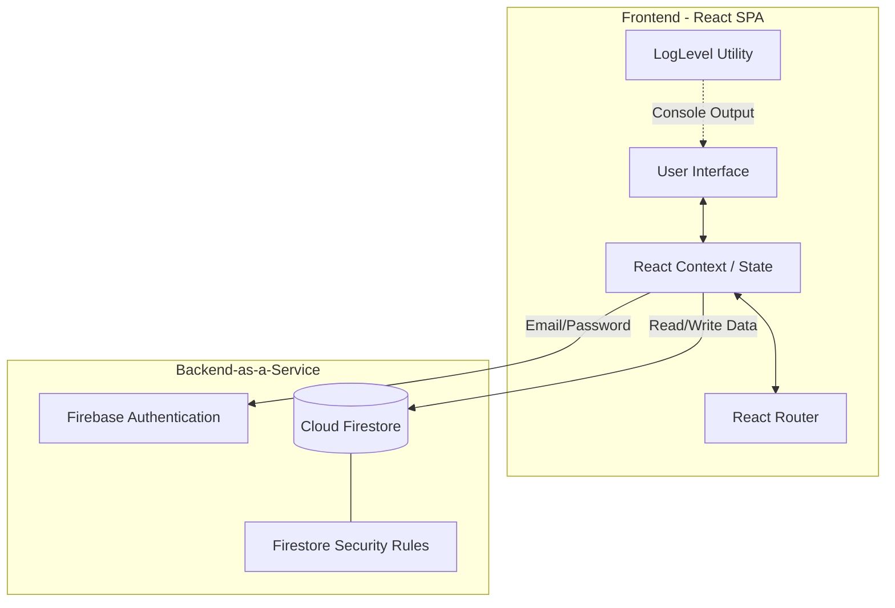

# System Architecture Document - AgroWebApp

## 1. Introduction
This document provides a high-level overview of the system architecture for the **AgroWebApp**. It describes the structural design, technology stack, data flow, and deployment strategy of the application.

## 2. High-Level Architecture

The AgroWebApp follows a **Serverless / Backend-as-a-Service (BaaS) Architecture**. The frontend is a Single Page Application (SPA) that communicates directly with Google Firebase services for authentication and database management, eliminating the need for a traditional middleware server.

*(Note: GitHub natively renders the diagram above using Mermaid.js)*

## 3. Technology Stack

### 3.1 Frontend (Client-Side)
*   **Core Framework:** React 18 (TypeScript)
*   **Build Tool:** Vite (for fast HMR and optimized production builds)
*   **Routing:** React Router DOM v6
*   **Styling:** Tailwind CSS (Utility-first CSS framework)
*   **Icons:** Lucide React
*   **Notifications:** React Hot Toast
*   **Logging:** Loglevel (for structured client-side logging)

### 3.2 Backend (Firebase)
*   **Authentication:** Firebase Auth (Email & Password provider)
*   **Database:** Cloud Firestore (NoSQL Document Database)
*   **Hosting:** Firebase Hosting / Vercel / Netlify (Target platforms)

## 4. Data Flow & Interaction Models

### 4.1 Authentication Flow
1. User submits credentials via the Login/Register form.
2. The client sends a request to **Firebase Auth**.
3. Upon success, Firebase returns a JWT and User Object.
4. The `AuthContext` listener (`onAuthStateChanged`) detects the login.
5. The app queries the `admins` Firestore collection using the User's UID.
6. The `AuthContext` sets the `userRole` (`'admin'` or `'user'`) and updates the UI routing accordingly.

### 4.2 Scheme Application Flow (Farmer)
1. Farmer navigates to the "Schemes" page.
2. Client fetches all available schemes from the `schemes` collection.
3. Client fetches the farmer's existing applications from the `applications` collection to disable the "Apply" button for already applied schemes.
4. Farmer clicks "Apply" on a new scheme.
5. Client writes a new document to the `applications` collection containing the `schemeId`, `userId`, and a `pending` status.
6. A success toast is displayed, and the local state is updated to reflect the applied status.

## 5. Security Architecture
*   **Route Protection:** The `<ProtectedRoute>` component wraps all private routes, verifying both authentication status and RBAC (Role-Based Access Control) before rendering.
*   **Database Security:** Firestore Security Rules dictate data access. 
    *   *Authentication required* for all reads/writes.
    *   *Admin-only writes* for `crops` and `schemes` collections.
    *   *Owner-only reads/writes* for user profiles and specific applications.

## 6. Deployment Strategy
The application is designed to be built into static HTML/CSS/JS files.
1. **Build Phase:** `npm run build` compiles the TypeScript and bundles the assets using Vite.
2. **Hosting:** The resulting `dist/` folder can be deployed to any static hosting provider (e.g., Firebase Hosting, Vercel, GitHub Pages).
3. **Environment Variables:** Firebase configuration keys are injected during the build process via `.env` files (`VITE_FIREBASE_API_KEY`, etc.).
